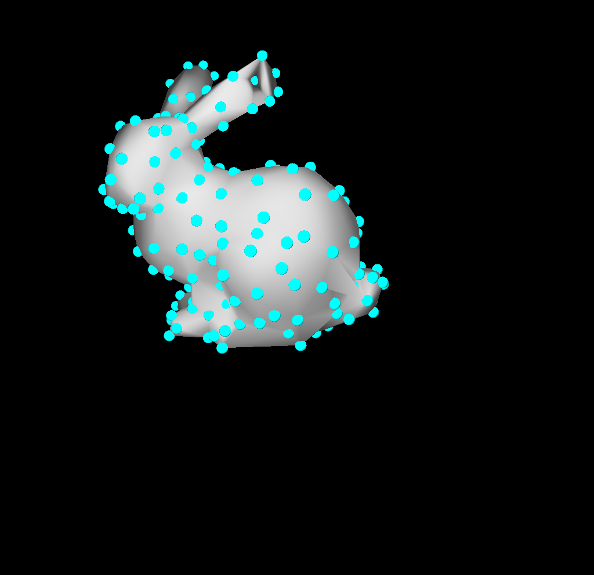

# 最小化的用太极读取obj格式模型的方法
mesh_data中是斯坦福兔子的OBJ文件，定义成了一个字典
tiReadMesh是导入OBJ顶点、三角面、四面体的功能模块
main.py是用来测试的例子

# Play
需要先安装taichi>=1.04
```
python main.py
```
将会展示


蓝色表示的是顶点

# 用法
在main.py中
1. 导入mesh_data以导入网格文件，其中你应该把网格文件替换成自己的
2. 导入tiReadMesh以导入taichi Field. 其中有四个field: pos是顶点粒子，tet是四面体对应的顶点编号，surf是表面三角面的顶点编号，edge是边的顶点编号。并且分别对应着numParticles, numTets, numSurfs, numEdges来表示这四种图元的数量。
3. 使用，对于pos
```
for i in range(numParticles):
    pos[i] 表示顶点i的三维坐标
```
```
for i in range(numTets):
    pos[tet[i][0]] 表示四面体i的第0号顶点的三维坐标
    pos[tet[i][1]] 表示四面体i的第1号顶点的三维坐标
    pos[tet[i][2]] 表示四面体i的第2号顶点的三维坐标
    pos[tet[i][3]] 表示四面体i的第3号顶点的三维坐标
```

```
for i in range(numSurfs):
    pos[surf[i][0]] 表示三角面i的第0号顶点的三维坐标
    pos[surf[i][1]] 表示三角面i的第1号顶点的三维坐标
    pos[surf[i][2]] 表示三角面i的第2号顶点的三维坐标
```

```
for i in range(numEdges):
    pos[edge[i][0]] 表示边i的第0号顶点的三维坐标
    pos[edge[i][1]] 表示边i的第1号顶点的三维坐标
    pos[edge[i][2]] 表示边i的第2号顶点的三维坐标
```

注意：
1. 因为tiReadMesh中已经有了ti.init(), main.py中不应该再出现ti.init
2. 用下面的代码调用taichi 的GGUI来画出网格
```
scene.mesh(pos, indices=surf_show)
```
的时候，需要注意indices接收一个taichi field。这个field得是一维的int型field，其大小是3*三角面数量。因此我们定义
```
surf_show = ti.field(int, numSurfs * 3)
surf_show.from_numpy(surf_np.flatten())
```
为indices接收的参数